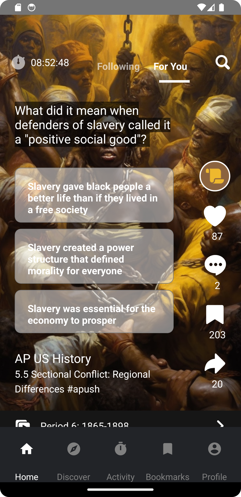

# React Native Atomic Design Project

## Table of Contents

- [Introduction](#introduction)
- [Project Overview](#project-overview)
- [In Scope](#in-scope)
- [Not in Scope](#not-in-scope)
- [Screens-iOS](#screens-ios)
- [Screens-Android](#screens-android)
- [API Endpoints](#api-endpoints)
- [Requirements](#requirements)
- [Third-Party Libraries](#third-party-libraries)
- [Evaluation Criteria](#evaluation-criteria)
- [Tips for Success](#tips-for-success)

## Introduction

Welcome to the React Native Atomic Design Project! This project focuses on implementing the "Home" screen of a TikTok clone for educational purposes. You will be using React Native with TypeScript to create a visually engaging and interactive user interface.

## Project Overview

In today's mobile-centric world, people prefer accessing the Internet on their mobile devices, leading to the growth of native apps on iOS and Android. However, maintaining separate codebases for each platform can be costly for companies. Cross-platform app development frameworks like React Native address this issue by allowing developers to write code in popular programming languages and translating it into a native version for each platform.

In this project, your goal is to implement the following features for the "Home" screen:

### In Scope

- Display content for the "Following" and "For You" sections of the "Home" screen.
- Show two types of content: Flashcards and Multiple Choice Questions (MCQs).
- Display the content's user name, user icon, and content description.
- Implement infinite scroll functionality for browsing content, similar to TikTok.
- Create a countdown timer at the top left to measure the time users spend in the app.

### Not in Scope

- Persisting state changes (e.g., self-ratings for flashcards or selected options for MCQs) to an API.
- Implementing Like, Comment, Share, and Bookmark buttons (just show them as static icons).
- Implementing navigation to User Profile, Search, or the Playlist (just show them as static icons/text).
- Implementing any sections of the app other than "Home" (Discover, Activity, Bookmarks, Profile).

## Screens-iOS

 

## Screens-Android

 

## API Endpoints

To implement this sample app, use the following API endpoints:

- **"Following" section**: GET `https://cross-platform.rp.devfactory.com/following`
  - Returns the next content item for the user’s Following section.

- **"For you" section**: GET `https://cross-platform.rp.devfactory.com/for_you`
  - Returns the next content item for the user’s For You section.

- **Reveal answer**: GET `https://cross-platform.rp.devfactory.com/reveal?id=X`
  - Reveal the correct answer for an MCQ question with id = X.

## Requirements

- You must implement the app using **React Native with TypeScript**.
- Implement the Home screen following industry best practices and adhere to the provided Quality Bar.

## Third-Party Libraries

The following third-party libraries are included in this project:

- **@react-navigation/bottom-tabs**: Version ^6.5.8
- **@react-navigation/material-top-tabs**: Version ^6.6.3
- **@react-navigation/native**: Version ^6.1.7
- **@react-navigation/native-stack**: Version ^6.9.13
- **@shopify/restyle**: Version ^2.4.2
- **axios**: Version ^1.5.0
- **react**: Version 18.2.0
- **react-native**: Version 0.72.4
- **react-native-gesture-handler**: Version ^2.12.1
- **react-native-linear-gradient**: Version ^2.8.3
- **react-native-pager-view**: Version ^6.2.1
- **react-native-reanimated**: Version ^3.5.1
- **react-native-reanimated-carousel**: Version ^3.5.1
- **react-native-safe-area-context**: Version ^4.7.2
- **react-native-screens**: Version ^3.25.0
- **react-native-svg**: Version ^13.13.0
- **react-native-tab-view**: Version ^3.5.2
- **react-native-vector-icons**: Version ^10.0.0

## Evaluation Criteria

Your work on this project will be evaluated based on the following criteria (listed in their order of importance):

1. **Implementing functionality aligned with the app specification**: Ensure that the implemented features match the provided app specification.

2. **Alignment to the provided high-fidelity design**: Pay attention to colors, layout, margins, paddings, fonts, and other design elements. Try to match the provided design as closely as possible.

3. **Following the Quality Bar**: Adhere to the quality standards provided. This includes code quality, structure, and best practices.

4. **Creating parameterized reusable components**: Leverage reusability by creating components that can be used throughout the app.

5. **Code clarity and maintainability**: Write clean and maintainable code. Remove any stale, unused code you find during development.

6. **Adherence to user-system preferences**: Consider user-system preferences such as color scheme, font size, and weight to enhance the user experience.

## Tips for Success

To excel in this project, consider the following tips:

- Pay attention to the details in both the specification and the design.
- Follow the provided Quality Bar for code quality and structure.
- If you see opportunities for reusability, refactor your code and create reusable components.
- Keep your code clean and remove any unnecessary or unused code.
- Make the application adhere to user-system preferences for a better user experience.

Thank you for your efforts in implementing the React Native Atomic Design Project. If you have any questions or need assistance, please don't hesitate to reach out to the project team. Good luck with your development!

## Project Folder structure

## License
Copyright tdmihiran@gmail.com,  Licensed under the MIT license.